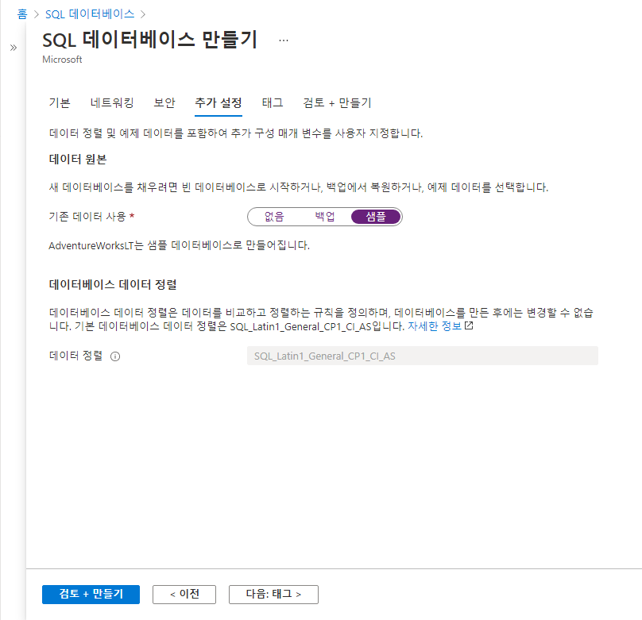

---
wts:
    title: '06 - SQL Database 만들기(5분)'
    module: '모듈 02 - 핵심 Azure 서비스(워크로드)'
---

# 06 -SQL Database 만들기(5분)

이 연습에서는 Azure에서 SQL Database를 만든 다음 해당 데이터베이스의 데이터를 쿼리합니다.

# 작업 1: 데이터베이스 만들기 

이 작업에서는 AdventureWorksLT 샘플 데이터베이스를 기반으로 SQL Database를 만듭니다. 

1. [**https://portal.azure.com**](https://portal.azure.com)에서 Azure Portal에 로그인합니다.

2. **모든 서비스** 블레이드에서 **SQL 데이터베이스**를 검색하여 선택한 다음 **+ 추가, + 만들기 및 + 새로 만들기**를 클릭합니다. 

3. **기본** 탭에서 다음 정보를 입력합니다.  

    | 설정 | 값 | 
    | --- | --- |
    | 구독 | **제공된 기본값 사용** |
    | 리소스 그룹 | **새 리소스 그룹 만들기** |
    | 데이터베이스 이름| **db1** | 
    | 서버 | **새로 만들기** 선택(오른쪽에 새 사이드바가 열림)|
    | 서버 이름 | **sqlserverxxxx**(고유해야 함) | 
    | 서버 관리자 로그인 | **sqluser** |
    | 암호 | **Pa$$w0rd1234** |
    | 위치 | **(미국) 미국 동부** |
    | 클릭  | **확인** |

   

4. **네트워킹** 탭에서 다음 설정을 구성합니다(다른 설정은 기본값으로 유지). 

    | 설정 | 값 | 
    | --- | --- |
    | 연결 방법 | **공용 엔드포인트** |    
    | Azure 서비스 및 리소스에서 이 서버에 액세스할 수 있도록 허용 | **예** |
    | 현재 클라이언트 IP 주소 추가 | **아니요** |
    
   

5. **보안** 탭을 클릭합니다. 

    | 설정 | 값 | 
    | --- | --- |
    | SQL용 Azure Defender| **나중에** |
    
6. **추가 설정** 탭으로 이동합니다. AdventureWorksLT 샘플 데이터베이스를 사용합니다.

    | 설정 | 값 | 
    | --- | --- |
    | 기존 데이터 사용 | **샘플** |

    

7. **검토 + 만들기**를 클릭한 다음 **만들기**를 클릭하여 리소스 그룹, 서버 및 데이터베이스를 배포하고 프로비전합니다. 배포에 약 2~5분이 걸릴 수 있습니다.


# 작업 2: 데이터베이스 테스트

이 작업에서는 SQL Server를 구성하고 SQL 쿼리를 실행합니다. 

1. 배포가 완료되면 배포 블레이드에서 리소스로 이동을 클릭합니다. 또는 **모든 리소스** 블레이드에서 **데이터베이스**를 검색하고 선택한 다음 **SQL 데이터베이스**를 선택하여 새 데이터베이스가 만들어졌는지 확인합니다. 페이지를 **새로 고침**해야 할 수 있습니다.

    

2. 만든 SQL 데이터베이스를 나타내는 **db1** 항목을 클릭합니다. db1 블레이드에서 **쿼리 편집기(미리 보기)** 를 클릭합니다.

3. **sqluser**와 암호 **Pa$$w0rd1234**를 사용하여 로그인합니다.

4. 로그인할 수 없습니다. 오류를 자세히 읽고 방화벽을 통해 허용해야 하는 IP 주소를 기록합니다. 

    

5. **db1** 블레이드로 돌아가서 **개요**를 클릭합니다. 

    

6. db1 **개요** 블레이드에서 개요 화면 위쪽 가운데에 있는 **서버 방화벽 설정**을 클릭합니다.

7. **+ 클라이언트 IP 추가**(위쪽 메뉴 모음)를 클릭하여 오류에서 언급된 IP 주소를 추가합니다 (IP 주소 필드로 붙여넣지 않은 경우 자동으로 채워진 것일 수 있음). 변경 내용을 **저장**해야 합니다. 

    

8. SQL 데이터베이스로 돌아와서(아래쪽 토글 막대를 왼쪽으로 밀어서) **쿼리 편집기(미리 보기)** 를 클릭합니다. 암호 **Pa$$w0rd1234**를 사용하여 **sqluser**로 다시 로그인해 봅니다. 이번에는 성공해야 합니다. 새 방화벽 규칙을 배포하는 데 몇 분 정도 걸릴 수 있습니다. 

9. 로그인에 성공하면 쿼리 창이 나타납니다. 편집기 창에 다음 쿼리를 입력합니다. 

    ```SQL
    SELECT TOP 20 pc.Name as CategoryName, p.name as ProductName
    FROM SalesLT.ProductCategory pc
    JOIN SalesLT.Product p
    ON pc.productcategoryid = p.productcategoryid;
    ```

    

10. **실행**을 클릭한 다음 **결과** 창에서 쿼리 결과를 검토합니다. 쿼리가 성공적으로 실행되어야 합니다.

    

축하합니다. Azure에서 SQL 데이터베이스를 만들고 해당 데이터베이스의 데이터를 성공적으로 쿼리했습니다.

**참고**: 이 리소스 그룹을 제거해 추가 비용이 발생하는 것을 방지할 수도 있습니다. 리소스 그룹을 검색하고 리소스 그룹을 클릭한 다음 **리소스 그룹 삭제**를 클릭합니다. 리소스 그룹의 이름을 확인한 다음 **삭제**를 클릭합니다. **알림**을 모니터링하여 삭제가 어떻게 진행되는지 확인합니다.
