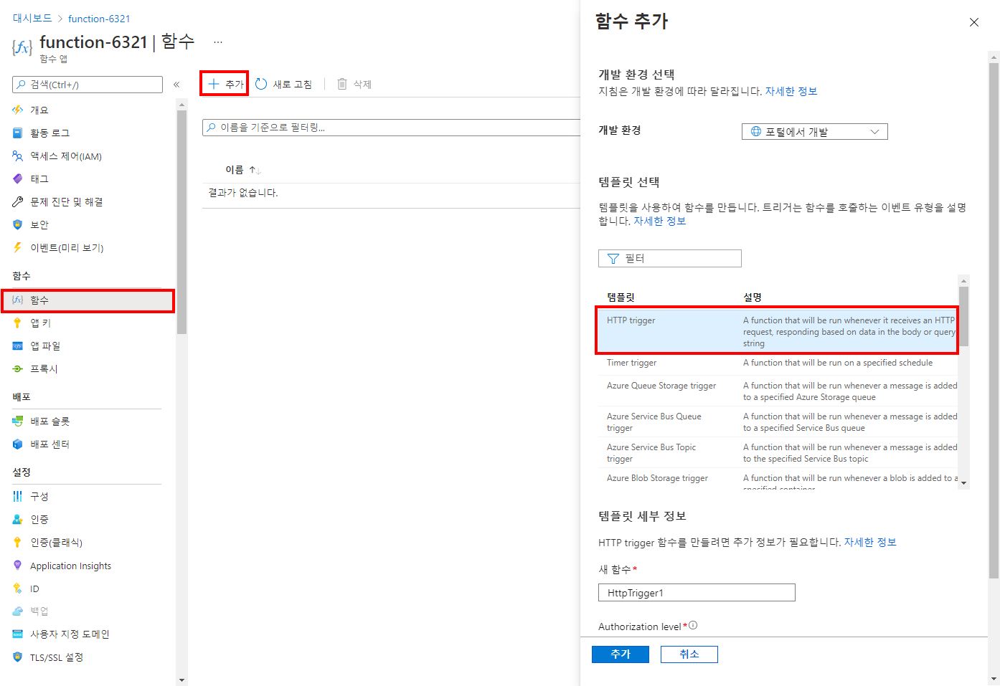

---
wts:
    title: '08 - Azure Functions 구현(5분)'
    module: '모듈 03: 핵심 솔루션 및 관리 도구 설명하기'
---
# 08 - Azure Functions 구현

이 연습에서는 HTTP 요청이 수신될 때 Hello 메시지를 표시하는 함수 앱을 만듭니다. 

# 작업 1: 함수 앱 만들기(5분)

이 작업에서는 함수 앱을 만듭니다.

1. [Azure Portal](https://portal.azure.com) 에 로그인합니다.

1. 포털 위쪽의 **리소스, 서비스 및 문서 검색** 텍스트 상자에서 **함수 앱** 을 검색 및 선택한 후 **함수 앱** 블레이드에서 **+ 추가** 를 클릭합니다.

1. **함수 앱** 블레이드의 **기본** 탭에서 다음 설정을 지정합니다(함수 이름의 **xxxx** 를 문자와 숫자로 바꿉니다. 이때 이름은 전역적으로 고유해야 하며 다른 모든 설정은 기본값으로 둡니다). 

    | 설정 | 값 |
    | -- | --|
    | 구독 | Azure 구독의 이름 |
    | 리소스 그룹 | 리소스 그룹 **myRGFunction**의 이름 |
    | 함수 앱 이름 | **function-xxxx** |
    | 게시 | **코드** |
    | 런타임 스택 | **.NET Core** |
    | 버전 | **3.1** |
    | 지역 | **미국 동부** |
    | | |

    **참고** - **xxxx** 를 변경하여 고유한 **함수 앱 이름** 을 만들어야 합니다.

1. **검토 + 만들기** 를 클릭하고 유효성 검사에 성공하면 **만들기** 를 클릭하여 새 Azure 함수 앱의 프로비전 및 배포를 시작합니다.

1. 리소스가 만들어졌다는 알림이 표시될 때까지 기다립니다.

1. **함수 앱** 블레이드로 다시 이동하여 **새로 고침** 을 클릭하고 새로 만든 함수 앱의 상태가 **실행 중** 인지 확인합니다. 

    

# 작업 2: HTTP 트리거 함수 만들기 및 테스트

이 작업에서는 HTTP 요청이 수신될 때 웹후크 및 API 함수를 사용하여 메시지를 표시합니다. 

1. **함수 앱** 블레이드에서 새로 만든 함수 앱을 클릭합니다. 

1. 함수 앱 블레이드의 **함수** 섹션에서 **함수** 를 클릭한 후 **+ 추가** 를 클릭합니다.

    

1. **새 함수** 블레이드의 **템플릿** 탭에서 **HTTP 트리거** 를 클릭합니다. 

    

1. **새 함수** 블레이드의 **세부 사항** 탭에서 기본 **새 함수** 이름 및 **권한 부여** 수준을 그대로 사용한 후 **함수 만들기** 를 클릭합니다. 

    

1. **HttpTrigger1** 블레이드의 **개발자** 섹션에서 **코드 + 테스트** 를 클릭합니다. 

1. **HttpTrigger1 \| 코드 + 테스트** 블레이드에서 자동 생성된 코드를 검토하고 코드가 HTTP 요청 및 로그 정보를 실행하도록 설계되어 있는지 확인합니다. 또한 이 함수가 이름과 함께 Hello 메시지를 반환하는지 확인합니다. 

    

1. 함수 편집기 상단에서 **함수 URL 가져오기** 를 선택합니다. 

1. **키** 드롭다운 값을 **기본값(함수 키)** 으로 설정합니다. 그런 다음 **복사** 를 선택하여 함수 URL을 복사합니다. 

    

1. 복사된 함수 URL을 웹 브라우저의 주소 표시줄에 붙여 넣습니다. 페이지가 요청되면 함수가 실행됩니다. 함수에 이름이 필요하다는 내용의 메시지가 표시됩니다. 

    

1. URL 끝에 **&name=*yourname*** 을 추가합니다. 

    **참고**: 여기서 ***yourname*** 은 사용자의 이름을 나타냅니다. 최종 URL은 다음과 유사합니다. `https://azfuncxxx.azurewebsites.net/api/HttpTrigger1?code=X9xx9999xXXXXX9x9xxxXX==&name=cindy`

    

1. 함수가 실행되면 추적 정보가 Azure의 로그 파일에 기록됩니다. Azure Portal에서 로그를 보려면 함수 편집기로 돌아가고 **로그** 단추를 선택합니다.

    

축하합니다! HTTP 요청이 수신될 때 Hello 메시지를 표시하는 함수 앱을 만들었습니다. 

**참고**: 추가 비용을 방지하려면 이 리소스 그룹을 제거할 수 있습니다. 리소스 그룹을 검색하고 리소스 그룹을 클릭한 다음 **리소스 그룹 삭제** 를 클릭합니다. 리소스 그룹의 이름을 확인한 다음 **삭제** 를 클릭합니다. **알림** 을 모니터링하여 삭제가 어떻게 진행되는지 확인합니다.
