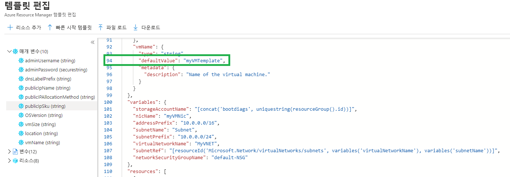

---
wts:
    title: '09 - 템플릿으로 VM 만들기(10분)'
    module: '모듈 03: 핵심 솔루션 및 관리 도구 설명하기'
---
# 09 - 템플릿으로 VM 만들기

이 연습에서는 QuickStart 템플릿을 사용하여 가상 머신을 배포하고 모니터링 기능을 검사합니다.

# 작업 1: 갤러리 탐색 및 템플릿 찾기(10분)

이 작업에서는 Azure QuickStart 갤러리를 찾아보고 가상 머신을 만드는 템플릿을 배포합니다. 

1. 브라우저에서 [Azure Quickstart 템플릿 갤러리](https://azure.microsoft.com/resources/templates?azure-portal=true)에 액세스합니다. 자주 사용하는 템플릿과 최근에 업데이트된 템플릿 다수가 갤러리에 표시됩니다. 이 템플릿은 인기 소프트웨어 패키지의 설치를 비롯하여 Azure 리소스의 배포를 자동화합니다.

2. 사용 가능한 다양한 유형의 템플릿을 탐색하세요. 

    **참고**: 적합한 템플릿이 있습니까?

3. [가상 머신 배포](https://azure.microsoft.com/resources/templates/101-vm-simple-windows?azure-portal=true) 템플릿을 검색하거나 직접 액세스하세요.

    **참고**: **Azure에 배포** 단추를 사용하면 Azure Portal을 통해 템플릿을 배포할 수 있습니다. 이러한 배포 중에는 작은 구성 매개 변수 집합만 입력하면 됩니다. 

4. **Azure에 배포** 단추를 클릭합니다. 브라우저 세션이 자동으로 [Azure Portal](http://portal.azure.com/)로 리디렉션됩니다.

5. 메시지가 표시되면 이 랩에서 사용할 Azure 구독에 로그인합니다.

6. **템플릿 편집**을 클릭합니다. Resource Manager 템플릿은 JSON 형식을 사용합니다. 매개 변수와 변수를 검토합니다.  그런 다음에 가상 머신 이름의 매개 변수를 찾습니다. 이름을 **myVMTemplate**로 변경합니다. 변경 내용을 **저장**합니다. Azure Portal에서 **사용자 지정 배포** 블레이드로 돌아갑니다.

    

7. **사용자 지정 배포** 블레이드에서 템플릿에 필요한 매개 변수를 구성합니다(DNS 레이블 접두사의 ***xxxx***를 문자와 숫자로 대체하여 레이블을 전역적으로 고유하게 지정). 다른 항목은 기본값을 사용합니다. 

    | 설정| 값|
    |----|----|
    | 구독 | **보유한 구독 선택**|
    | 리소스 그룹 | **myRGTemplate**(새로 만들기) |
    | 위치 | **(미국) 미국 동부** |
    | 관리자 사용자 이름 | **azureuser** |
    | 관리 암호 | **Pa$$w0rd1234** |
    | DNS 레이블 접두사 | **myvmtemplate*xxxx*** |
    | Windows OS 버전 | **2019-Datacenter** |
    | | |
    
    ** 참고: 이 템플릿은 무료입니다.

9. **검토 + 만들기**를 클릭합니다.

10. 배포를 모니터링합니다. 

# 작업 2: 가상 머신 배포 확인 및 모니터링

이 작업에서는 올바르게 배포된 가상 머신을 확인합니다. 

1. **모든 서비스** 블레이드에서 **가상 머신**을 검색하고 선택합니다.

2. 새 가상 머신이 만들어졌는지 확인합니다. 

    

3. 가상 머신을 선택하고 **개요** 창에서 아래로 스크롤하여 모니터링 데이터를 봅니다.

    **참고**: 1시간~30일로 모니터링 기간을 조정할 수 있습니다.

4. **CPU(평균)**, **네트워크(총계)** 및 **디스크 바이트(총계)** 등 제공되는 다양한 차트를 검토합니다. 

    

5. 원하는 차트를 클릭합니다. **메트릭 추가** 및 차트 유형 변경이 가능합니다.

6. **개요** 블레이드로 돌아갑니다.

7. **활동 로그**(왼쪽 창)를 클릭합니다. 활동 로그는 리소스 생성 또는 수정 같은 이벤트를 기록합니다. 

8. **필터 추가**를 클릭하고 다양한 이벤트 유형 및 작업을 검색하여 실험합니다. 

    

**참고**: 추가 비용을 방지하려면 이 리소스 그룹을 제거할 수 있습니다. 리소스 그룹을 검색하고 리소스 그룹을 클릭한 다음 **리소스 그룹 삭제**를 클릭합니다. 리소스 그룹의 이름을 확인한 다음 **삭제**를 클릭합니다. **알림**을 모니터링하여 삭제가 어떻게 진행되는지 확인합니다.
