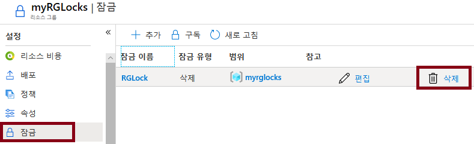

---
wts:
    title: '15 - 리소스 잠금 관리(5분)'
    module: '모듈 05: ID, 거버넌스, 개인 정보 및 규정 준수 기능에 대해 설명하기'
---
# 15 - 리소스 잠금 관리(5분)

이 연습에서는 리소스 그룹에 잠금을 추가하고 리소스 그룹 삭제를 테스트합니다. 구독에서 리소스 그룹 또는 개별 리소스에 잠금을 적용하여 중요한 리소스가 실수로 삭제되거나 수정되는 상황을 방지할 수 있습니다.  

# 작업 1:  리소스 그룹에 잠금 추가 및 삭제 테스트

이 작업에서는 리소스 그룹에 리소스 잠금을 추가하고 리소스 그룹 삭제를 테스트합니다. 

1. [Azure Portal](https://portal.azure.com)에 로그인합니다.

2. Azure Portal에서 리소스 그룹 **myRGLocks**로 이동합니다.

3. 구독, 리소스 그룹 또는 개별 리소스에 잠금을 적용하면 중요한 리소스가 실수로 삭제되거나 수정되는 상황을 방지할 수 있습니다. 

4. **설정** 섹션에서 **잠금**을 클릭한 다음 **+ 추가**를 클릭합니다. 

    

5. 새 잠금을 구성합니다. 작업이 완료되면 **확인**을 클릭합니다. 

    | 설정 | 값 |
    | -- | -- |
    | 잠금 이름 | '''RGLock''' |
    | 잠금 유형 | **삭제** |
    | | |

6. **개요** 창에서 **리소스 그룹 삭제**를 클릭합니다. 리소스 그룹의 이름을 입력하고 **확인**을 클릭합니다. 리소스 그룹이 잠겨 있고 삭제할 수 없다는 오류 메시지가 나타납니다.

    

# 작업 2: 리소스 그룹의 구성원 삭제 테스트

이 작업에서는 리소스 잠금이 리소스 그룹의 스토리지 계정을 보호하는지 테스트합니다. 

1. **모든 서비스** 블레이드에서 **스토리지 계정**을 검색하여 선택한 다음 **+ 추가, + 만들기 또는 + 새로 만들기**를 클릭합니다. 

2. **+추가 +새로 만들기 +만들기** 블레이드의 **스토리지 계정** 페이지에서 다음 정보를 채웁니다(스토리지 계정 이름의 **xxxx**를 이름이 전역적으로 고유하도록 문자와 숫자로 대체). 다른 항목은 기본값을 사용합니다.

    | 설정 | 값 | 
    | --- | --- |
    | 구독 | **보유한 구독 선택** |
    | 리소스 그룹 | **myRGLocks** |
    | 스토리지 계정 이름 | **storageaccountxxxx** |
    | 위치 | **(미국) 미국 동부**  |
    | 성능 | **표준** |
    | 계정 종류 | **StorageV2(범용 v2)** |
    | 복제 | **LRS(로컬 중복 스토리지)** |
    | 액세스 계층(기본값) | **핫** |
   

3. **검토 + 만들기**를 클릭하여 스토리지 계정 설정을 검토하고 Azure에서 구성의 유효성을 검사할 수 있도록 허용합니다. 

4. 유효성 검사가 끝나면 **만들기**를 클릭합니다. 계정이 성공적으로 생성되었다는 알림을 기다립니다. 

5.  스토리지 계정이 성공적으로 생성되었다는 알림을 기다립니다. 

6. 새 스토리지 계정에 액세스하고 **개요** 창에서 **삭제**를 클릭합니다. 리소스 또는 해당 상위 항목에 삭제 잠금이 설정되었다는 오류 메시지가 표시됩니다. 

    

    **참고**: 스토리지 계정에 특정된 잠금을 만들지는 않았지만 스토리지 계정이 포함된 리소스 그룹 수준에서 잠금을 만들었습니다. 이와 같이 이 *상위* 수준 잠금은 리소스 삭제를 차단하며 스토리지 계정은 상위 항목의 잠금을 상속합니다.

# 작업 3: 리소스 잠금 제거

이 작업에서는 리소스 잠금을 제거하고 테스트합니다. 

1. **myRGLocks-XXXXXXXX** 리소스 그룹 블레이드로 돌아가 **설정** 섹션에서 **잠금**을 클릭합니다.
    
2. **myRGLocks-XXXXXXXX** 항목의 맨 오른쪽에서, **편집** 바로 오른쪽에 있는 **삭제** 링크를 클릭합니다.

    

3. 스토리지 계정 블레이드로 돌아가서 리소스를 삭제할 수 있는지 확인합니다.

축하합니다. 리소스 그룹을 만들고, 리소스 그룹에 잠금을 추가하고, 삭제를 테스트하고, 리소스 그룹의 리소스 삭제를 테스트하고, 리소스 잠금을 제거했습니다. 

**참고**: 이 리소스 그룹을 제거해 추가 비용이 발생하는 것을 방지할 수도 있습니다. 리소스 그룹을 검색하고 리소스 그룹을 클릭한 다음 **리소스 그룹 삭제**를 클릭합니다. 리소스 그룹의 이름을 확인한 다음 **삭제**를 클릭합니다. **알림**을 모니터링하여 삭제가 어떻게 진행되는지 확인합니다.
